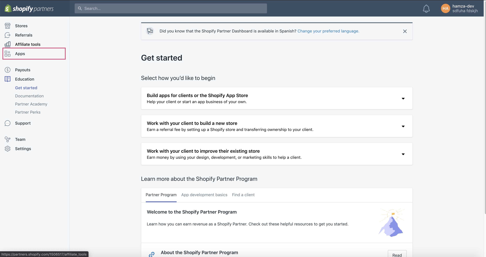
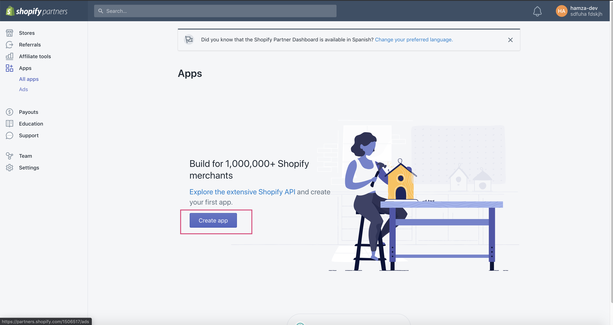
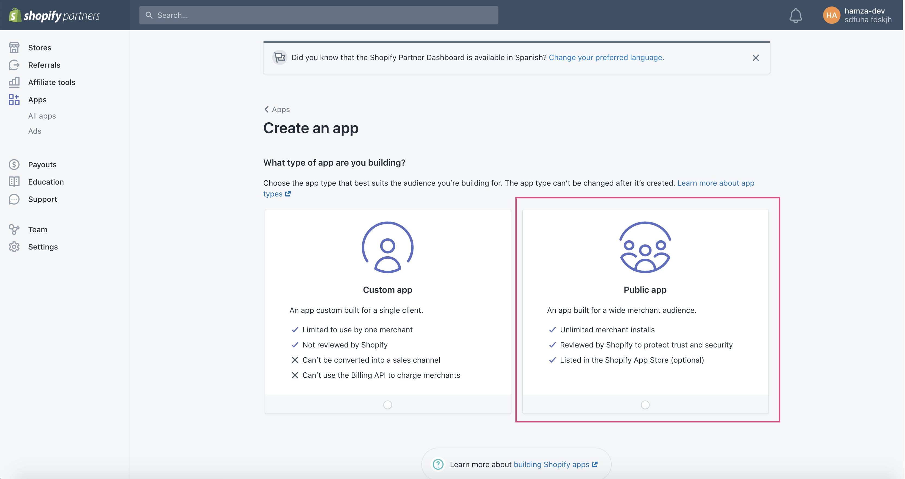
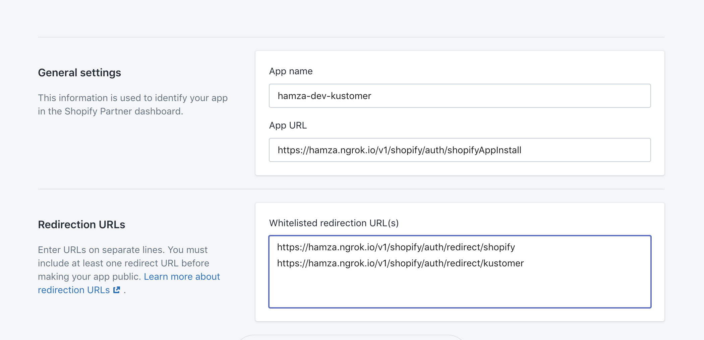
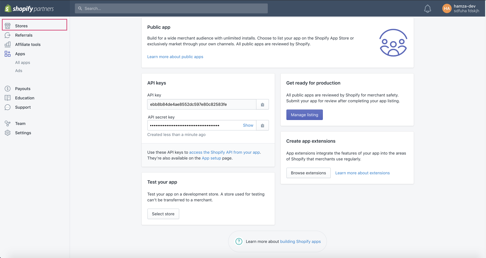
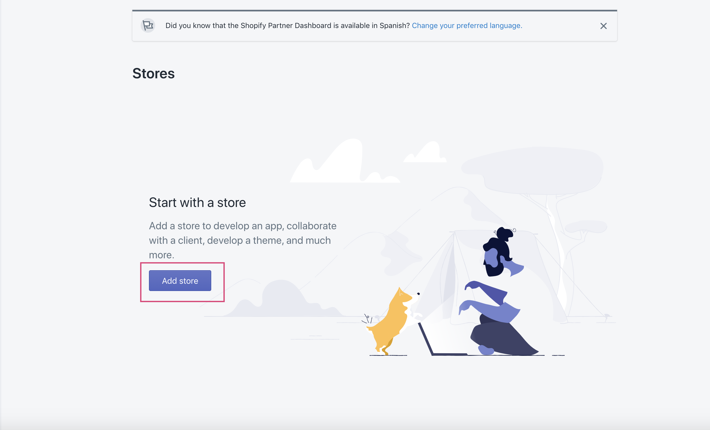

# Shopify

## Description

The Shopify app allows users to interact with orders placed in their Shopify store from within Kustomer. The app includes:

- A workflow that ingests a Shopify order and creates a corresponding KObject
- An insight card that allows Kustomer agents to view and modify orders from within the Kustomer Timeline.

The source code for the insight card can be found [here](https://github.com/kustomer/card-kustomer-shopify).

There are also two back-end services involved in the integration:

- [Shopify API Service](https://github.com/kustomer/shopify) - contains controllers for interacting with the Shopify API. This service handles the OAuth flow, serves webhook requests, and acts as a intermediary between Kustomer and the [Shopify API](https://shopify.dev/api).
- [Shopify Worker Service](https://github.com/kustomer/shopify-worker) - process shopify order updates as well as order migrations

See the [Shopify API service](https://github.com/kustomer/shopify/blob/master/ARCHITECTURE.md) and [Shopify Worker service](https://github.com/kustomer/shopify/blob/master/ARCHITECTURE.md) architecture docs for more detailed information regarding the technical details of those services.

## Development & Testing

In order to develop against this integration locally, you will need to create a Shopify Partner account. Follow the steps below:

1. Navigate to the [Shopify Partner signup page](https://accounts.shopify.com/signup) and sign up for an account.
1. Once you log into your dashboard, click on **Apps** on the left sidebar
   
1. Create a new app
   
1. Click **Create Public App** and fill in the info below then click **Create App**:
   - App Name = <YOUR NAME>-kustomer-dev
   - App Url = https://<NGROK URL>/v1/shopify/auth/shopifyAppInstall
   - Whitelisted redirection URL(s):

     ```
     https://<NGROK URL>/v1/shopify/auth/redirect/shopify
     https://<NGROK URL>/v1/shopify/auth/redirect/kustomer

     ```

     
     
1. Scroll down to **Api Keys** section and copy your **API KEY** and **API SECRET KEY** and add them to your `.env` file.
   SHOPIFY_API_KEY=<API KEY>
   SHOPIFY_SECRET_KEY=<API SECRET KEY>
1. Now we need to create a test store to test against. Click on the **Stores** option and create a new one after verifying your email.
   
   
1. Choose **Development Store** as **Store Type** and fill in the rest and click save.
1. On the left hand side, click **Customers** and add a new customer.
1. Once you have done that, navigate to your Shopify Partner account, go to **Apps** and select your app.
1. Scroll down to **Test Your App** and click **Select Store**
1. Choose the store you created above to go through the OAuth handshake to install Shopify.
1. After successful installation, you should be able to see a Shopify insight card on the right panel of the Timeline

To develop against QA and/or Staging, ask around the `#dev` Slack channel to be invited to the Kustomer QA and Staging Shopify Partner accounts then set up your test store with the Kustomer QA|Staging app in Shopify.

Once your Shopify store is set up and connected to your Shopify app within Kustomer, you can now begin creating orders and viewing/modifying them from the Kustomer Timeline. To create orders, do the following:

1. Add products that your store sells. (**Products -> Add Product**)
1. Add customers that your store can sell to. (**Customers -> Add Customers**)

Note: Your customers should have emails and/or phone numbers that match customers within Kustomer. If they don't, the customer will be created for you based on the information given in Shopify.

At this point, you can begin creating orders. Navigate to **Orders** and click **Create Order**. Create the order with any product(s) that you wish and ensure that you add a customer to the order. Once the order is created, you should see the order appear in the Kustomer Timeline for that customer. Any updates made to the order from within Shopify will be reflected in the order in Kustomer via the workflow. You can also make certain order updates from within the Kustomer Timeline, such as performing a refund or cancellation of an order.

## Documentation & Troubleshooting

[KB Article](https://help.kustomer.com/shopify-integration-rkei5NSL)  
[Shopify API Docs](https://shopify.dev/api)  
[Shopify API Service](https://github.com/kustomer/shopify)  
[Shopify Worker Service](https://github.com/kustomer/shopify-worker)  
[Shopify Insight Card](https://github.com/kustomer/card-kustomer-shopify)  

**Why do I get an error during authorization related to the `read_all_orders` permission when setting up the app for a new store?**  
Shopify apps must get approval from Shopify to use this scope, and our test apps for our lower environments cannot go through this approval process. 

To resolve this, navigate to `/helpers/constants.js` in your shopify API service and remove `read_all_orders` from the `SCOPES` array, then try to install the app in Shopify again. If you're setting up the store with an org in QA, deploy your branch to QA then try again. **Do not commit this change to master**.

**Why do I get an `invalid oauth_redirect` error during authorization when setting up the app for a new store?**
It's likely that your Shopify `App URL`, `SHOPIFY_SECRET_KEY` and/or `SHOPIFY_API_KEY` values are incorect. Confirm that these values are correct then try again.
